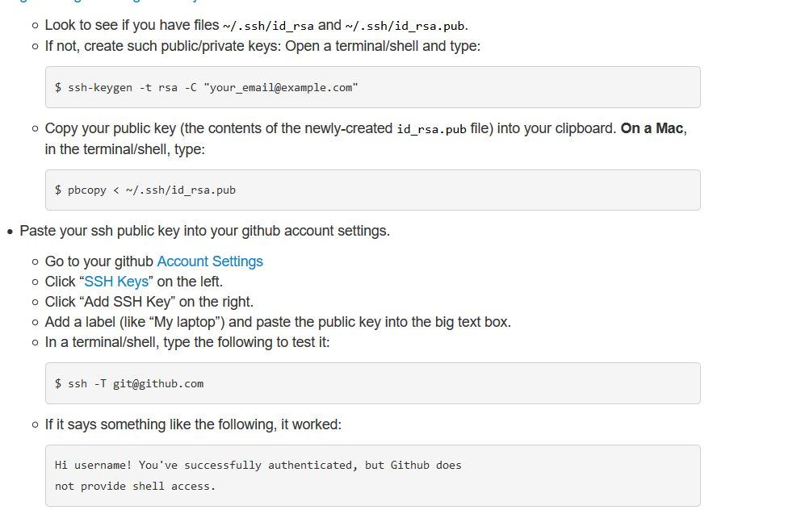

# How to set up Git

To set up Git you'll need to do the following
1. Download, install, and configure Git on your computer
   *  [Download Git](https://git-scm.com/downloads)  
      Click on the desired operating system download  

   * Set up git with your user name and email.
     Open Git Bash.--  for windows, type git bash on search  

      Set a Git username:  
      In the git bash terminal enter the below command  

         >$ git config --global.user.email " youremail"  
         >$ git config --global user.name "Yourusername"  

      Confirm that you have set the Git username correctly:   
      enter command:  
          >$ git config --global user.name   
	  > "yourusername"   

      Your terminal should look like

2. Get a GitHub Account
         Sign up at [GitHub](https://github.com/)  

3. Set up authentication between GitHub and Git  

    Creating SSH keys provide access to a Git repository in Github without explicit login.   
    To set up SSH authentication follow be below guide   

          

You are all set!

